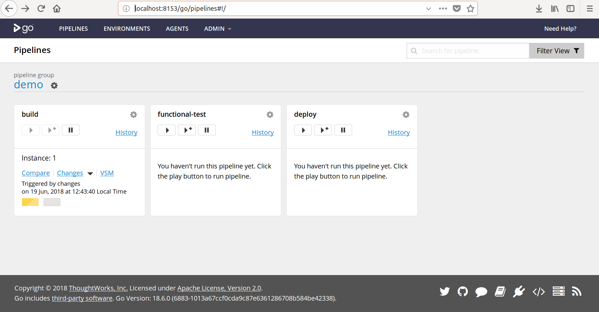

# vagrant-ci-gocd
Vagrant setup to spin up GoCD (server and one agent) using Ansible 

## Pre-requisites

The host machine needs to have the following installed/set up:

- [Vagrant](https://www.vagrantup.com/downloads.html)
- A [Vagrant "provider"](https://www.vagrantup.com/docs/providers/) (Vagrant supports [VirtualBox](https://www.virtualbox.org/) and [Hyper-V](https://www.microsoft.com/hyper-v) out-of-the-box, so these are good options)
- A Vagrant box with CentOS 7 - this is done by running "`vagrant box add centos/7`" after installing vagrant
- [Ansible](https://docs.ansible.com/ansible/latest/installation_guide/intro_installation.html#installing-the-control-machine) version 2.2 or higher (if not sure, check by running "`ansible --version`" after installing)
- Port 8153 open - this is the default port for the GoCD web UI (HTTP requests on this port in the localhost get forwarded to the virtual machine created by Vagrant) and while it's not a commonly used port, please make sure it's available for Vagrant

## Usage

### Start GoCD

To launch a new virtual machine and automatically set up and launch the GoCD server and agent simply run this command from the root folder:

`vagrant up`

The whole process should take anywhere between 5 and 10 minutes, if everything goes well.

Once finished successfully you should see an output similar to the above screenshot (number of retries when waiting for some tasks might vary). In particular, the summary at the end should show "unreachable=0" and "failed=0", meaning that everything worked as expected. 

(see troubleshooting section below otherwise)

Now you should be able to browse to the GoCD web UI:

http://localhost:8153/go

and see an initial demo pipeline, either already built or in the process (see "Example pipeline" section below for more details):

### Update running VM

If for some reason you need to modify the provisioning tasks and update a running VM, simply run from the root folder:

`vagrant provision`

Note: make sure the new/modified [tasks are idempotent](https://shadow-soft.com/ansible-idempotency-configuration-drift/), so the provisioning code can be run multiple times with same end result.

### Tests

For the initial setup we are using a single virtual machine created by Vagrant. The Ansible provisioning process installs 3 "roles" on this VM: go-server, go-agent and an example pipeline. 

Each role details a series of tasks to configure the VM. At the end of each role, we test for an expected outcome that informs us that the role was set up correctly:

- **go-server**: we check that the web URL http://localhost:8153/go returns the expected HTTP response
- **go-agent**: we check that the agent has been registered with the server
- **example-pipeline**: we check that GoCD has picked up the pipeline definitions from a repo and proceeded to update its list of pipelines (more details below in section "Example pipeline")

## Virtual Machine Environment

The created virtual machine runs on a CentOS 7 operating system, and will have Java 8 ([openjdk](http://openjdk.java.net/projects/jdk8/)) and [git](https://git-scm.com/doc) installed.

## Example pipeline

## Troubleshooting

As mentioned in the "Pre-requisites" section, port conflicts could prevent the forwarding of HTTP requests from the localhost to the virtual machine, should there be another service using port 8153 on localhost.

For any other issues, don't hesitate to contact us by email at: me at manuelpais dot net

We will be updating this section should further issues be encountered and reported to us.

## Next steps

This initial version of **vagrant-ci-gocd** sets up the basic environment for GoCD, and is expected to evolve with usage.

Some areas that should definitely be looked into before putting this version in "production" (i.e. available to all development teams) include:

1. <u>set up secure access to GoCD</u>

   By default, GoCD does not require authentication. However, it [supports multiple authorization mechanisms](https://docs.gocd.org/current/configuration/dev_authentication.html) such as LDAP or social providers like Google, GitHub, etc. Role-based access is also supported, and can be useful for example to restrict write access to some activities in a pipeline.

2. <u>scale agents / finetune resources</u>
   As mentioned, the current setup installs both the server and one agent on the same VM. This will work fine for a limited number of builds/pipelines but usage should be monitored over time and resources scaled to support an agent farm sized according to usage needs.

3. <u>add granular infrastructure tests as you scale</u>
   Currently, we are testing that each role has been set up correctly with Ansible by waiting for a given resource to exist. As the infrastructure and number of VMs grows it is recommended to have more fine-grained testing in place, for example using [Serverspec](https://serverspec.org/).

